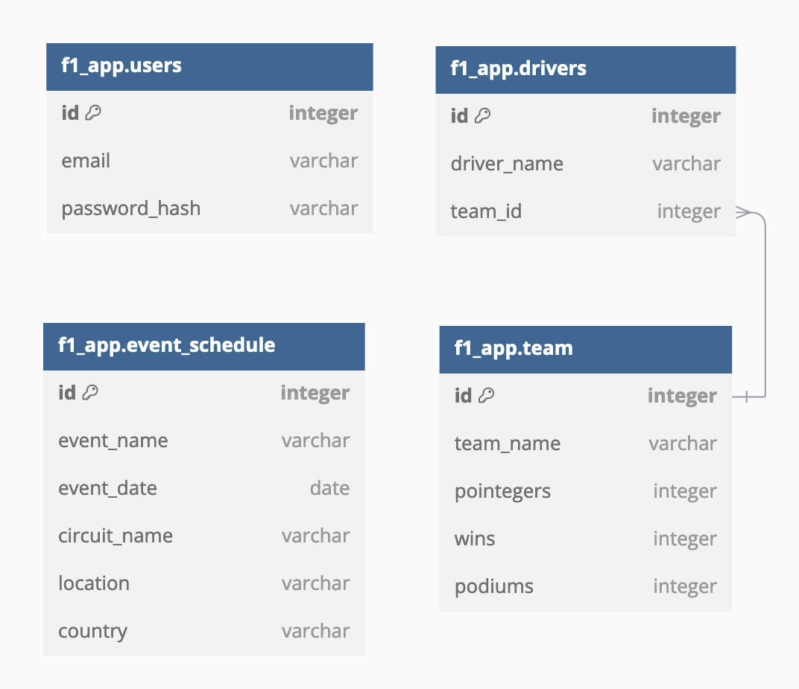

# F1 Dashboard

F1 Dashboard is a web application that provides real-time updates and management tools for Formula 1 racing events. It features live race updates, team standings, event schedules, and an admin panel for managing race data.

## Features

- Live race updates with real-time standings
- Team standings and statistics
- Event schedule management
- Admin panel for adding events, teams, and updating team points
- User authentication for admin access

## Technologies Used

- Frontend: Vue.js 3, Vite, Bootstrap 5
- Backend: PHP, Laravel
- Database: MySQL
- API: RESTful API
- Real-time updates: Server-Sent Events (SSE)

## High level architecture


## DB Diagram



## Setup and Installation

### Prerequisites

- **Docker** installed on your machine.
- **Docker Compose** installed on your machine.
- An external MySQL database to connect to.
    - After creating a database instance, run `php artisan migrate` to create tables, or run `php artisan migrate --seed` to create table with dummy data.

### **Step 1: Clone the Repository**

Clone this repository to your local machine:
```bash
git https://github.com/davidperumalchang/f1-dashboard-php.git
cd f1-dashboard-php/
```

### **Step 2: Configure Backend Environment Variables**

Modify the `.env` file in the root directory (`f1-dashboard-php/`) and configure your environment variables for the following:

```
DB_CONNECTION=mysql
DB_HOST=<db_host>
DB_PORT=3306
DB_DATABASE=<db_name>
DB_USERNAME=<db_username>
DB_PASSWORD=<db_password>
JWT_SECRET=<jwt_secret>
```

### **Step 2.1: Configure Front Environment Variables**

Modify the `.env` file in the frontend directory (`f1-dashboard-php/frontend/`) and configure your environment variables for the following:

```
VITE_API_URL=http://localhost:8000/api/v1/
```

### **Step 3: Build and Run the Application**

Use the `Makefile` to build and run the Docker containers:

```
make build && make run
```
- The make command above will build Docker images and run the images for both backend and frontend.
- If you wish to build and run Docker images for backend and frontend separately, provide the `services` parameter to the make file. Example below

Backend
```
make build services=backend && make run services=backend
```
Frontend
```
make build services=frontend && make run services=frontend
```

### **Step 4: Access the API**

The backend API should now be running and accessible at `http://localhost:8000`.

### **Step 5: Access the Web App**

The F1 Dasbhboard web app should now be running and accessible at `http://localhost:5173`.

## Available Make Commands

- `make build`: Build the Docker containers, use services argument to pass list of services. by default - all services.
- `make run`: Run Docker containers in detached mode, use services argument to pass list of services. by default - all services.
- `make stop`: Stops Docker containers, use services argument to pass list of services. by default - all services.
- `make clear`: Stops and removes all Docker containers.
- `make rebuild`: Rebuild Docker containers without cache, use services argument to pass list of services. by default - all services.