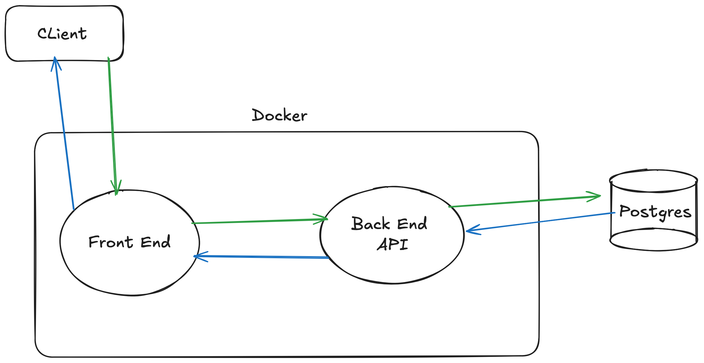

# F1 Dashboard

F1 Dashboard is a web application that provides real-time updates and management tools for Formula 1 racing events. It features live race updates, team standings, event schedules, and an admin panel for managing race data.

## Features

- Live race updates with real-time standings
- Team standings and statistics
- Event schedule management
- Admin panel for adding events, teams, and updating team points
- User authentication for admin access

## Technologies Used

- Frontend: Vue.js 3, Vite, Bootstrap 5
- Backend: Node.js, Express.js
- Database: PostgreSQL
- API: RESTful API
- Real-time updates: Server-Sent Events (SSE)

## High level architecture



## DB Diagram


## Setup and Installation

### Prerequisites

- **Docker** installed on your machine.
- **Docker Compose** installed on your machine.
- An external PostgreSQL database to connect to.
    - After creating a database instance, you can use the `schema.sql` file (located at `f1-dashboard/backend/database/schema.sql`) to create DB schema and tables

### **Step 1: Clone the Repository**

Clone this repository to your local machine:

```bash
git clone https://github.com/davidperumalchang/f1-dashboard.git
cd f1-dashboard/
```

### **Step 2: Configure Backend Environment Variables**

Modify the `.env` file in the root directory (`f1-dashboard/`) and configure your environment variables for the following:

```
DB_USER=
DB_HOST=
DB_DATABASE=
DB_PASSWORD=
DB_PORT=
API_PORT=4000
JWT_SECRET=
```

Sample
```
DB_USER=postgres
DB_HOST=127.0.0.1
DB_DATABASE=blog_app_db
DB_PASSWORD=some_password_123
DB_PORT=5432
API_PORT=4000
JWT_SECRET=some_secret_key
```

### **Step 2.1: Configure Front Environment Variables**

Modify the `.env` file in the frontend directory (`f1-dashboard/frontend/`) and configure your environment variables for the following:

```
VITE_API_URL=
```

Sample
```
VITE_API_URL=http://localhost:4000/api
```

### **Step 3: Build and Run the Application**

Use the `Makefile` to build and run the Docker containers:

```
make build && make run
```
- The make command above will build Docker images and run the images for both backend and frontend.
- If you wish to build and run Docker images for backend and frontend separately, provide the `services` parameter to the make file. Example below

Backend
```
make build services=backend && make run services=backend
```
Frontend
```
make build services=frontend && make run services=frontend
```

### **Step 4: Access the API**

The backend API should now be running and accessible at `http://localhost:4000`.

### **Step 5: Access the Web App**

The Bloggerfy web app should now be running and accessible at `http://localhost:3000`.

### **API Documentation**

API documentation is generated using Swagger and can be accessed at `http://localhost:4000/api-docs` after the server is up and running.

## Available Make Commands

- `make build`: Build the Docker containers, use services argument to pass list of services. by default - all services.
- `make run`: Run Docker containers in detached mode, use services argument to pass list of services. by default - all services.
- `make stop`: Stops Docker containers, use services argument to pass list of services. by default - all services.
- `make clear`: Stops and removes all Docker containers.
- `make rebuild`: Rebuild Docker containers without cache, use services argument to pass list of services. by default - all services.